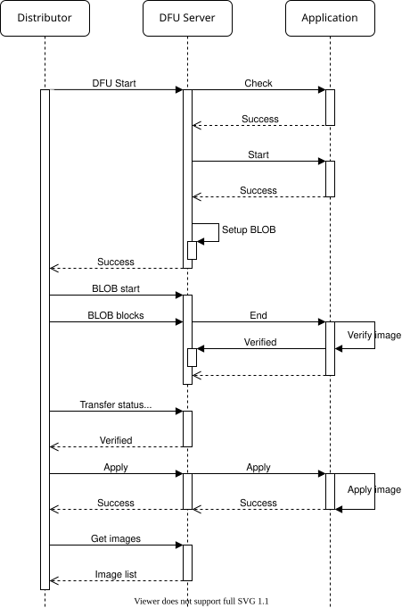

.. _bluetooth_mesh_dfu_srv:

Device Firmware Upgrade Server
##############################

The Device Firmware Upgrade (DFU) Server model implements the Firmware Upgrade Target node functionality of the :ref:`bluetooth_mesh_dfu` subsystem. It extends the :ref:`bluetooth_mesh_blob_srv`, which it uses to receive the firmware image binary from the Distributor node.

Together with the extended BLOB Server model, the DFU Server model implements all the required functionality for receiving firmware upgrades over the mesh, but does not provide any functionality for storing, applying or verifying the images.

Firmware images
***************

The DFU Server holds a list of all the upgradeable firmware images on the device. The full list shall be passed to the server through the ``_imgs`` parameter in :c:macro:`BT_MESH_DFU_SRV_INIT`, and must be populated before the Bluetooth Mesh subsystem is started. Each firmware image in the image list must be independently upgradeable, and should have its own firmware ID.

For instance, a device with an upgradable bootloader, an application and a peripheral chip with firmware upgrade capabilities could have three entries in the firmware image list, each with their own separate firmware ID.

Receiving transfers
*******************

The DFU Server model uses a BLOB Server model on the same element to transfer the binary image. The interaction between the DFU Server, BLOB Server and application is described below:

   Bluetooth Mesh DFU Server transfer

Transfer check
==============

The transfer check is an optional pre-transfer check the application can perform on incoming firmware image metadata. The DFU Server performs the transfer check by calling the :cpp:member:`check <bt_mesh_dfu_srv_cb::check>` callback.

The result of the transfer check is a pass/fail status return and the expected :cpp:type:`bt_mesh_dfu_effect`. The DFU effect return parameter will be communicated back to the DFU Distributor, and should indicate what effect the firmware upgrade will have on the mesh state of the device. If the transfer will cause the device to change its composition data or become unprovisioned, this should be communicated through the effect parameter of the metadata check.

Start
=====

The Start procedure prepares the application for the incoming transfer. It'll contain information about which image is being upgraded, as well as the upgrade metadata.

The DFU Server :cpp:member:`start <bt_mesh_dfu_srv_cb::start>` callback must return a pointer to the BLOB Writer the BLOB Server will send the BLOB to.

BLOB transfer
=============

After the setup stage, the DFU Server prepares the BLOB Server for the incoming transfer. The entire firmware image is transferred to the BLOB Server, which passes the image to its assigned BLOB Writer.

At the end of the BLOB transfer, the DFU Server calls its :cpp:member:`end <bt_mesh_dfu_srv_cb::end>` callback.

Image verification
==================

After the BLOB transfer has finished, the application should verify the image in any way it can to ensure that it is ready for being applied.
Once the image has been verified, the application calls :cpp:func:`bt_mesh_dfu_srv_verified`.

If the image can't be verified, the application calls :cpp:func:`bt_mesh_dfu_srv_rejected`.

Applying the image
==================

Finally, if the image was verified, the Distributor may instruct the DFU Server to apply the transfer. This is communicated to the application through the :cpp:member:`apply <bt_mesh_dfu_srv_cb::apply>` callback. The application should swap the image and start running with the new firmware. The firmware image table should be updated to reflect the new firmware ID of the upgraded image.

When the transfer applies to the mesh application itself, the device might have to reboot as part of the swap. This restart can be performed from inside the apply callback, or done asynchronously. After booting up with the new firmware, the firmware image table should be updated before the Bluetooth Mesh subsystem is started.

The Distributor will read out the firmware image table to confirm that the transfer was successfully applied. If the metadata check indicated that the device would become unprovisioned, the Target node is not required to respond to this check.

API reference
*************

.. doxygengroup:: bt_mesh_dfu_srv
   :project: Zephyr
   :members:
